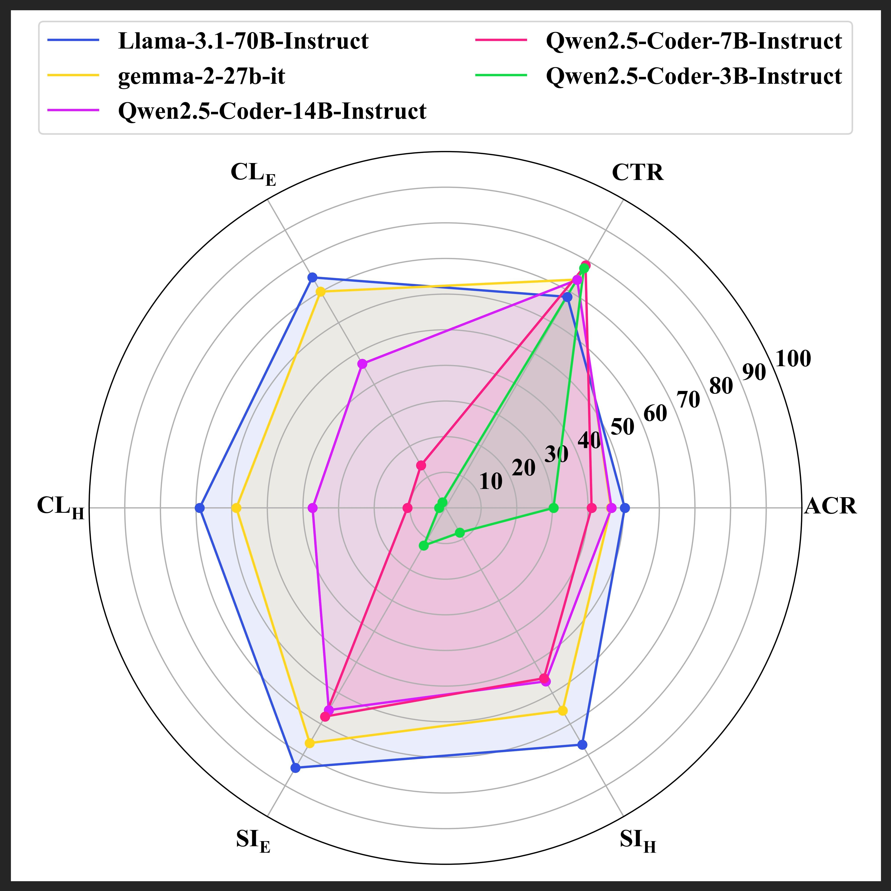

# CodeReviewQA
The repository contains inference scripts for reproducing experiments in [CodeReviewQA: The Code Review Comprehension Assessment for Large Language Models](https://arxiv.org/abs/2503.16167)

The benchmark is available on [Hugging Face Datasets](https://huggingface.co/datasets/Tomo-Melb/CodeReviewQA).

## Dependency
This project requires python3 to run.
To setup all dependencies, use the following command: `pip3 install -r requirements.txt`

## Introduction
The task of automated code refinement aims to automate the developer's perspective in resolving an actionable code review comment provided by a reviewer. This is a generative task, where the LLM is required to revise a pre-review code submission with respect to the natural language code review comment to produce an intended post-review code revision. CodeReviewQA further breaks down this generative task into three intermediate reasoning steps (represented as MCQA problems) to provide early signals for model development.

<div align="center">
  
</div>

<div align="center">(The image on the left was generated by <a href="https://openai.com/sora/">Sora</a>)</div>

The benchmark features 900 manually curated, high-quality examples across nine programming languages (100 examples each). Each example represents a real interaction between a human reviewer and developer in a collaborative code review scenario. Different from clear instruction-esque prompts, code review comments are often underspecified, ambiguous, and implicit. Thus, this problem assesses LLMs' proficiency in understanding and following conversational instructions in human-oriented software development. 

<div align="center">
  
</div>

<div align="center">(Our paper includes more comprehensive results from 72 state-of-the-art LLMs)</div>

## Tasks

**Original Problem** (Text-to-Text Generation)
- **Automated Code Refinement (ACR):** Given a pre-review code submission and code review comment, generate the post-review code revision that is being requested.

**Intermediate Reasoning Steps** (Multiple Choice Question Answering)
- **Change Type Recognition (CTR):** Given a pre-review code submission and code review comment, infer the general code change type that is being requested.
- **Change Localisation (CL):** Given a pre-review code submission and code review comment, locate the precise lines of code that need to be revised.
- **Solution Identification (SI):** Given a pre-review code submission and code review comment, identify the exact code revision that is being requested.

(Both Change Localisation and Solution Identification have easy (E) and hard (H) difficulty variations, where the hard version represents an adversarial setup.)

## Included Languages

- **Natural Language:** English
- **Programming Language:** C, C++, CSharp, Go, Java, JavaScript, PHP, Python, Ruby

## File Structure
```
.
├── ACR_vLLM.py                 # Inference script for Automated Code Refinement
├── CL_vLLM.py                  # Inference script for Change Localisation
├── CTR_vLLM.py                 # Inference script for Change Type Recognition
├── graphics
├── LICENSE                 
├── README.md
├── requirements.txt            # List of dependencies required for the project
├── results                     # Folder for storing all inference results
│   ├── acr
│   ├── cl
│   ├── ctr
│   └── si
├── SI_vLLM.py                  # Inference script for Solution Identification
└── utils.py                    # Prompt templates and evaluation functions
```

##  Usage
**Running Inference Scripts**
```
### Change the arguments as required
# huggingface_token: your hugging face access token
# language: C, CPP, CSharp, Go, Java, JavaScript, PHP, Python, Ruby
# mode: difficulty for change localisation/solution identification i.e., easy, hard
# model_name: hugging face model name e.g., meta-llama/Llama-3.1-8B-Instruct

python3 ACR_vLLM.py <huggingface_token> <language> <model_name> 
python3 CTR_vLLM.py <huggingface_token> <language> <model_name>
python3 CL_vLLM.py <huggingface_token> <language> <mode> <model_name>
python3 SI_vLLM.py <huggingface_token> <language> <mode> <model_name>
```

##  Reference
```
@article{lin2025codereviewqa,
  title={CodeReviewQA: The Code Review Comprehension Assessment for Large Language Models},
  author={Lin, Hong Yi and Liu, Chunhua and Gao, Haoyu and Thongtanunam, Patanamon and Treude, Christoph},
  journal={arXiv preprint arXiv:2503.16167},
  year={2025}
}
```